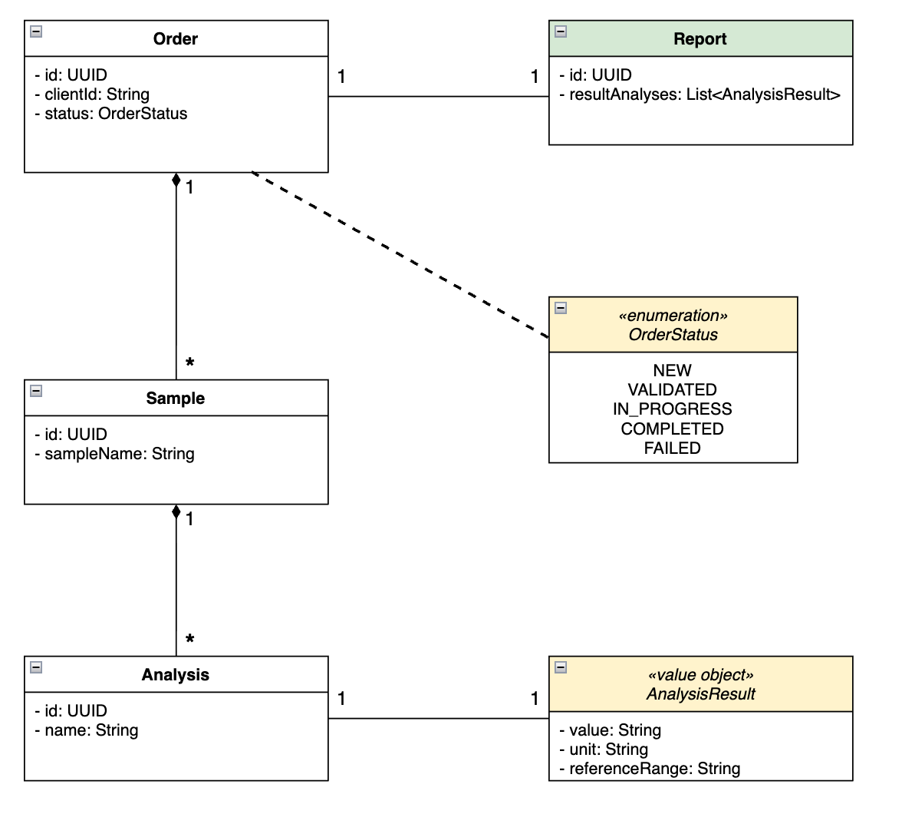
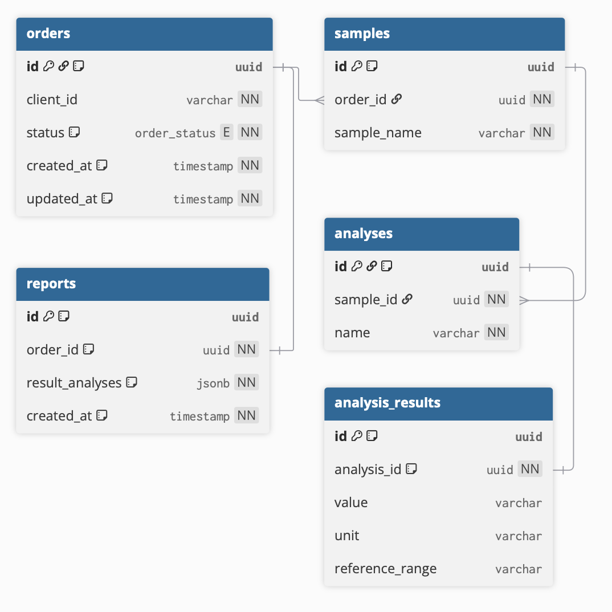

# Order Manager

A Kotlin/Spring Boot backend that acts as a bridge between external clients (e.g. supermarket distribution centers) and a LIMS (Laboratory Information Management System). It manages the full lifecycle of lab orders: from ingestion to report delivery.

## Domain Model



An **order** belongs to a client and contains one or more **samples**. Each sample has one or more **analyses** to be performed. Once the LIMS completes the analyses, it creates a **report** and transitions the order to `COMPLETED`.

Order statuses: `NEW` → `VALIDATED` → `IN_PROGRESS` → `COMPLETED`

## Architecture

```
External Clients ──▶ Order Manager ──(RabbitMQ)──▶ LIMS
                          ▲
                          │
                     SOAP API (POST /orders/soap-client)
```

- **REST API** — exposes endpoints for clients and the LIMS
- **RabbitMQ** — orders are published to a queue and consumed by the LIMS
- **SOAP integration** — the SOAP API pushes XML orders to `POST /orders/soap-client`, which uses Kotlin coroutines to transform and publish each order to RabbitMQ in parallel
- **PostgreSQL** — persists orders, samples, analyses, and reports

## Endpoints

| Method | Path | Description |
|--------|------|-------------|
| `POST` | `/orders` | Create a new order |
| `GET` | `/orders` | List all orders |
| `GET` | `/orders/{clientOrderId}` | Get order by client order ID |
| `POST` | `/orders/{clientOrderId}/status` | Update order status (called by LIMS) |
| `POST` | `/orders/{clientOrderId}/report` | Submit a report (called by LIMS) |
| `GET` | `/orders/{clientOrderId}/report` | Get the report for an order |
| `POST` | `/orders/soap-client` | Receive XML orders from the SOAP API |

## Tech Stack

| Technology | Version |
|------------|---------|
| Kotlin | 2.2.21 |
| Spring Boot | 4.0.6 |
| PostgreSQL | 16 |
| RabbitMQ | 3 |
| Kotlin Coroutines | — |
| Maven | — |

## Database Schema



## Running Locally

Start the required infrastructure:

```bash
docker compose -f docker-compose-test.yml up -d
```

Then run the application:

```bash
./mvnw spring-boot:run
```

## Running Tests

Integration tests require the Docker Compose containers to be running (see above).

```bash
./mvnw test
```

Unit tests use [MockK](https://mockk.io/) and [kotlinx-coroutines-test](https://kotlinlang.org/api/kotlinx.coroutines/kotlinx-coroutines-test/) and run without any infrastructure.

## Example Payloads

See the [`documentation/`](documentation/) folder for example JSON and XML payloads.
